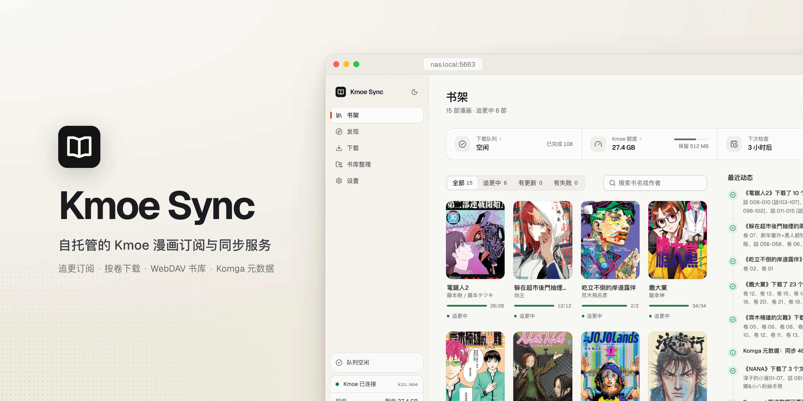
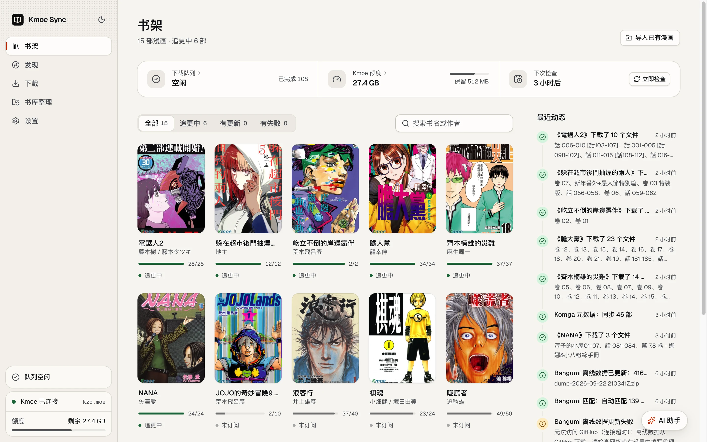
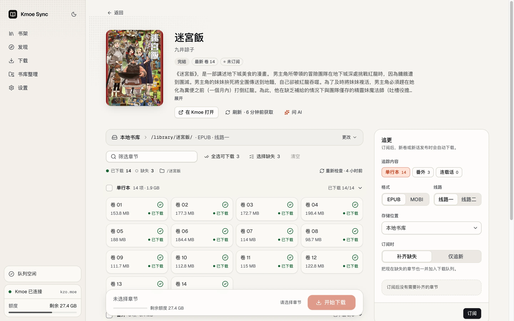
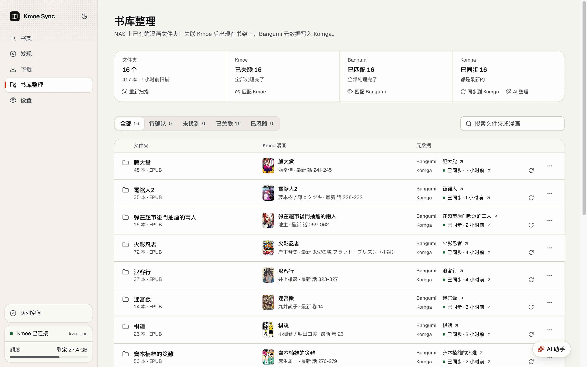
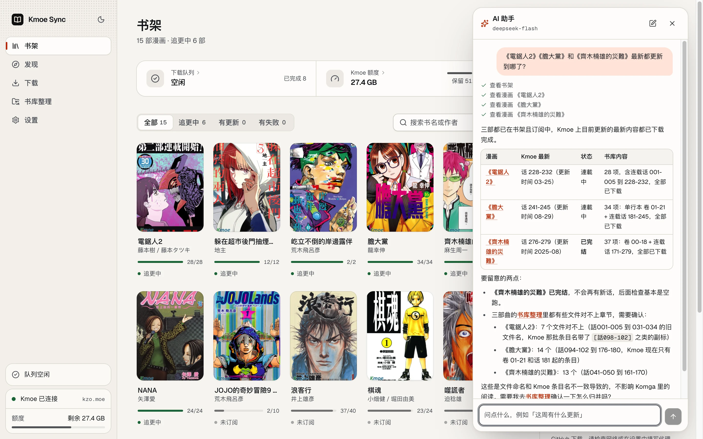
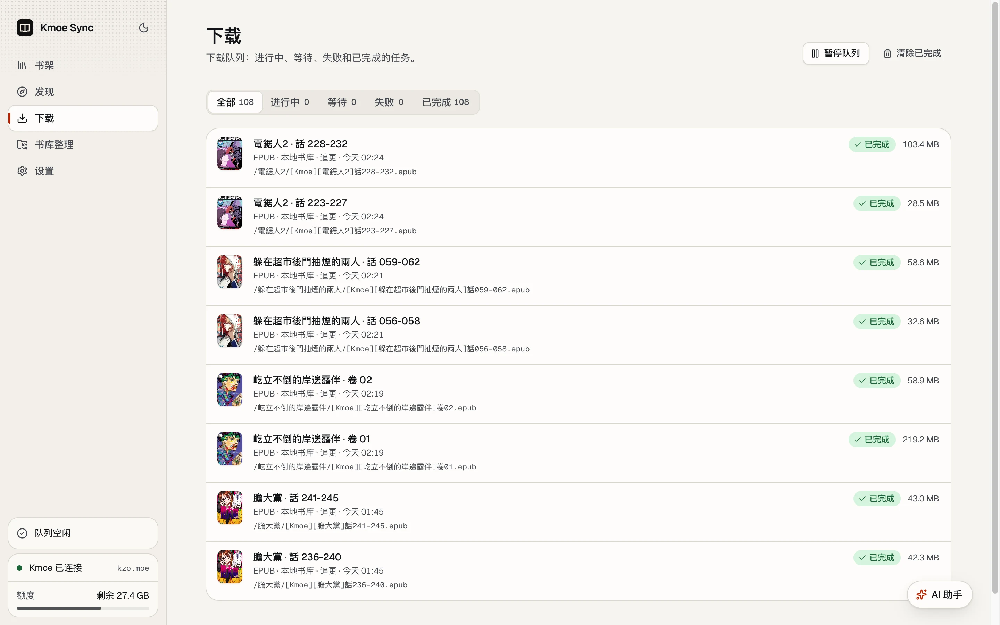
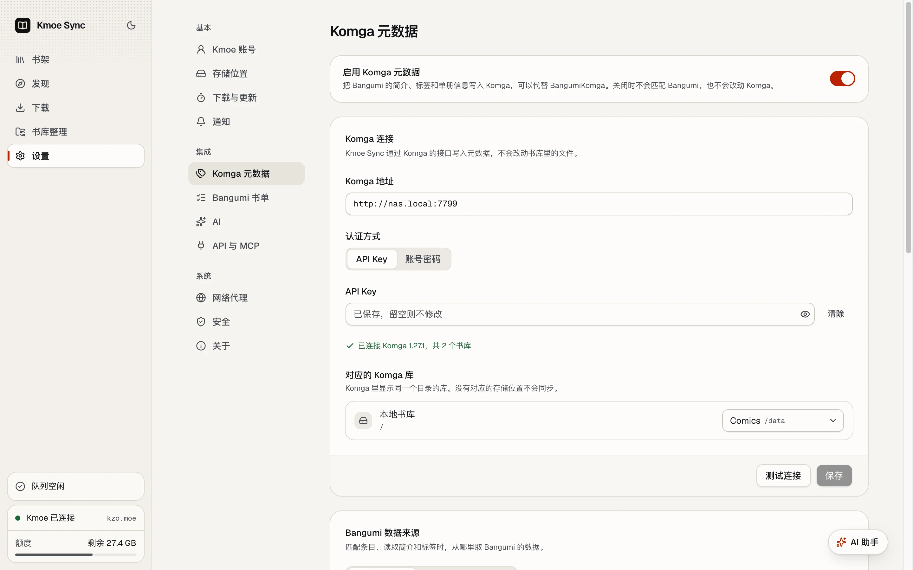
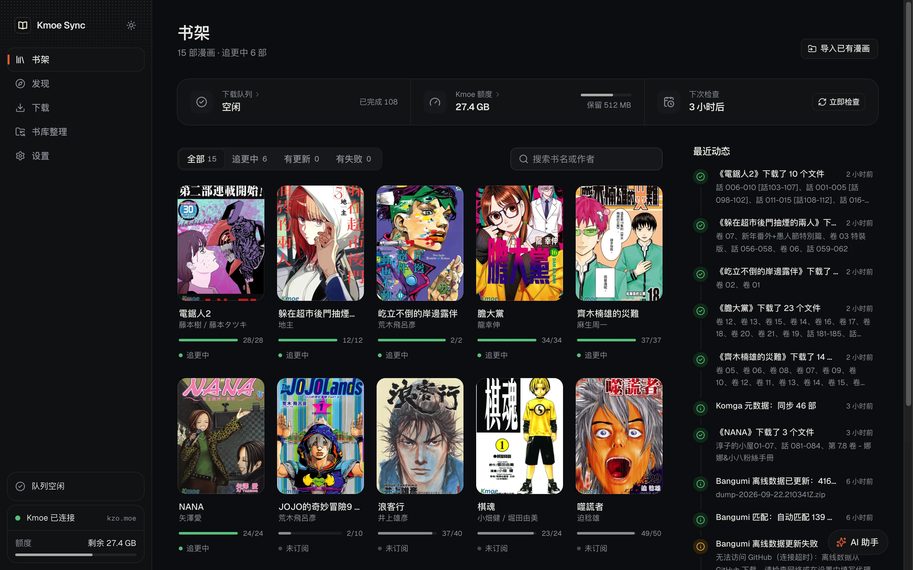
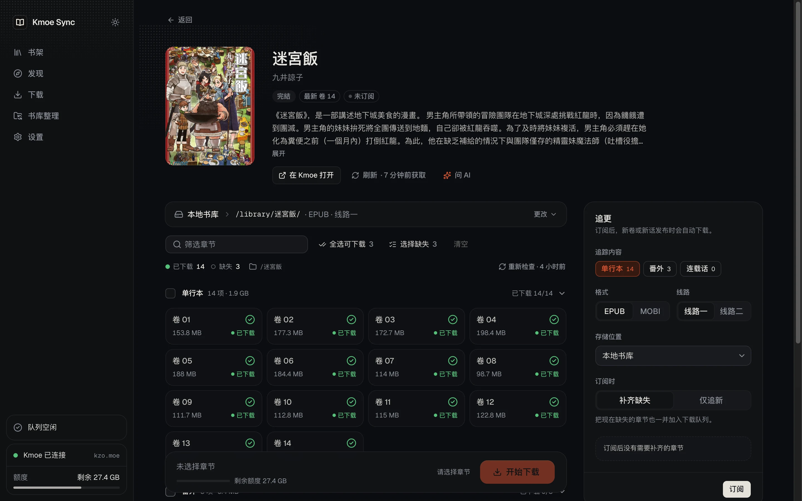

<div align="center">

<picture>
  <source media="(prefers-color-scheme: dark)" srcset="docs/images/banner-dark.webp">
  
</picture>

[](https://github.com/benis-me/kmoe-sync/actions/workflows/ci.yml)
[](LICENSE)
[](https://github.com/benis-me/kmoe-sync/pkgs/container/kmoe-sync)


**自托管在 NAS 上的 Kmoe 漫画订阅与同步服务。**<br>
登录一次 Kmoe，订阅追更、按卷挑选下载，EPUB / MOBI 自动存进 NAS 本地目录或 WebDAV；<br>
已有的漫画文件夹一键导入，Bangumi 元数据写入 Komga，还有一个会帮你干活的 AI 助手。

[截图](#截图) · [功能](#功能) · [快速开始](#快速开始) · [配置](#配置) · [常见问题](#常见问题) · [API 与 MCP](docs/api.md) · [参与贡献](CONTRIBUTING.md)

</div>

> [!NOTE]
> Self-hosted manga subscriptions and downloads for Kmoe: follow series, pick volumes, save EPUB / MOBI to a NAS
> folder or WebDAV, import an existing library, write Bangumi metadata into Komga, and ask an AI assistant to do the chores.
> The interface is in Simplified Chinese.

Kmoe Sync 在 NAS 上 7×24 小时运行：定时检查更新、排队下载、断点续传，额度不够或登录失效时暂停并通知你，
恢复后自动继续。所有操作都在网页里完成，手机上也一样好用。

## 截图

<table>
  <tr>
    <td width="50%"></td>
    <td width="50%"></td>
  </tr>
  <tr>
    <td align="center"><b>书架</b>：追更状态、下载进度、最近动态</td>
    <td align="center"><b>漫画页</b>：按卷挑选下载、追更设置、书库检查</td>
  </tr>
  <tr>
    <td></td>
    <td></td>
  </tr>
  <tr>
    <td align="center"><b>书库整理</b>：已有文件夹 ↔ Kmoe 漫画 ↔ Bangumi 条目 ↔ Komga</td>
    <td align="center"><b>AI 助手</b>：查询、订阅、下载、排查问题，改动前先确认</td>
  </tr>
  <tr>
    <td></td>
    <td></td>
  </tr>
  <tr>
    <td align="center"><b>下载</b>：并发、重试、断点续传与校验</td>
    <td align="center"><b>设置</b>：存储位置、Komga 元数据、AI、网络代理……</td>
  </tr>
</table>

<p align="center">
  
</p>
<p align="center">手机上同样好用；浅色 / 深色跟随系统，也可以在侧栏左上角切换。</p>

<details>
<summary>深色模式</summary>




</details>

## 功能

**追更与下载**

- **订阅追更**：按单行本 / 番外 / 连载话订阅，默认「补齐缺失」（也可以只追新）；定时检查（默认每 6 小时，带随机抖动），新章节自动下载并通知。
- **按卷挑选下载**：章节网格支持整组全选、Shift 连选和键盘操作，显示每项大小、页数与状态，底栏实时汇总大小与额度占比。
- **可靠的下载队列**：并发可调；断线自动重试并断点续传；校验 EPUB / MOBI 完整性；目标位置已有同名同大小的文件时不覆盖。
- **无人值守**：Kmoe 额度不足、登录失效或网络中断时暂停队列并通知，恢复后自动继续。
- **两种书库**：NAS 本地目录（挂载的 `/library` 下任意子目录）与 WebDAV（群晖、坚果云、Nextcloud、Alist……），可设默认位置。

**书库整理与元数据**

- **导入已有漫画**：扫描 NAS 上已有的漫画文件夹。从 Kmoe 下载的 EPUB 里记着它属于哪部漫画，直接关联；其余按文件夹名和文件名搜索，
  标题一致的自动关联，相近的给出候选让你确认。关联后出现在书架上，已有的卷算作已下载。文件不会被移动或改名。
  其中连载中的漫画可以一键追更（仅追新：之后出的新卷按文件夹原来的格式下载，不补旧卷）。
- **Bangumi → Komga 元数据**：为每个系列匹配 Bangumi 条目，把标题、简介、标签、状态、出版社、阅读方向（可在设置里选）和单册信息（卷号、发售日、ISBN）写入 Komga，
  可锁定字段、可选封面。**新下载的卷会自动同步**（见 [元数据如何自动更新](#元数据如何自动更新)），可以替代单独运行的 BangumiKomga。
- **Bangumi 书单**：同步 bgm.tv 用户的想看 / 在看等收藏，逐条匹配到 Kmoe 漫画后订阅。
- **书库检查**：按命名规则核对本地或 WebDAV 上已有的文件，避免重复下载、浪费额度。

**AI（可选）**

- 接入任何 OpenAI 兼容接口：DeepSeek、OpenRouter，或自建的 Ollama、LM Studio 等。
- **AI 判定**：从候选里挑出对应的 Kmoe 漫画和 Bangumi 条目，把握大的直接关联，其余标出推荐和理由等你确认；搜不到时换几种写法再搜。
- **AI 整理**：把 Bangumi 的简介和标签整理干净，逐条确认后才写入 Komga，随时可以改回原来的。
- **AI 助手**：右下角（漫画页里是「问 AI」）。用中文查询、订阅、下载、排查问题；知道你正在看哪一页，回答带表格、列表和可以点开的漫画链接；
  订阅、下载、暂停队列等会改动东西的操作都要你点确认。

**集成**

- **通知**：Webhook、Bark、Telegram，按事件订阅（新章节、下载完成 / 失败、登录失效、额度不足）。
- **REST API 与 MCP**：可以让 Claude Code、Cursor 等 AI 客户端直接搜索、订阅和下载，见 [docs/api.md](docs/api.md)。
- **从扩展迁移**：导入浏览器扩展导出的配置（WebDAV 服务器与命名规则）。

## 快速开始

需要 Docker（群晖 Container Manager、Unraid、TrueNAS、普通 Linux 都可以）。镜像支持 `linux/amd64` 与 `linux/arm64`。

```yaml
# compose.yaml
services:
  kmoesync:
    image: ghcr.io/benis-me/kmoe-sync:latest
    container_name: kmoesync
    restart: unless-stopped
    ports:
      - "5663:8080"            # NAS 端口 5663（KMOE 的九宫格键位），容器内固定 8080
    environment:
      TZ: Asia/Shanghai
      PUID: "1000"             # 书库文件的属主（群晖常见 1026:100，Unraid 99:100）
      PGID: "1000"
    volumes:
      - ./data:/data           # 数据库、加密的 Kmoe 会话、封面缓存
      - /path/to/comics:/library
```

```bash
docker compose up -d
```

然后打开 `http://<NAS 地址>:5663`：

1. **设置管理员密码**。请部署后立刻设置：在此之前，能访问这个端口的人都可以抢先设置。
2. **设置 → Kmoe 账号**：登录 Kmoe。密码默认只用于这一次登录、不会保存；勾选「记住密码」后，登录失效时会自动重新登录。
3. **设置 → 存储位置**：默认已有指向 `/library` 的「本地书库」，也可以添加 WebDAV。
4. 去 **发现** 搜索漫画，订阅或挑选要下载的卷；已有的漫画在 **书库整理** 里扫描导入。

可选：**设置 → Komga 元数据** 连接 Komga；**设置 → AI** 填写模型服务；**设置 → 通知** 添加推送。

> [!TIP]
> 想自己构建镜像：把仓库克隆下来后运行 `docker compose build`（根目录的 [compose.yaml](compose.yaml) 同时写了镜像和构建方式）。

### 群晖 / Portainer（NAS 拉不到镜像时）

NAS 连不上镜像仓库时，可以在电脑上打包，让 NAS 从局域网直接构建：

1. 电脑上运行 `scripts/nas-context.sh amd64`（ARM 机型用 `arm64`），得到 `dist-nas/kmoesync-context-amd64.tar.gz`，
   再用 `python3 -m http.server 8000 -d dist-nas` 在局域网临时提供下载。
2. Portainer → Images → Build a new image：名称 `kmoesync:latest`，方式选 URL，填 `http://<电脑 IP>:8000/kmoesync-context-amd64.tar.gz`。
3. Portainer → Stacks → Add stack，填入上面的 compose 配置（`image` 改成 `kmoesync:latest`）并部署。
   **群晖不会自动创建挂载的目录**，请先在 File Station 里建好数据目录，例如 `/volume1/docker/kmoesync`。

更新时重复第 1、2 步，然后在 Stack 里点「Update the stack」，**不要**勾选 Re-pull image（镜像只在本地）。

### 书库权限与 CPU 兼容

- 设置 `PUID` / `PGID` 后，服务以该用户写入 `/library`，所以书库目录必须对它可写（通常填书库目录属主的 UID/GID，
  可在容器里用 `ls -ln /library` 查看）。不设置时以 root 运行。启动日志出现「不可写」警告时，请在 NAS 上给该用户写权限。
- amd64 版使用 baseline 构建，不需要 AVX2（J1900、J3455、J4125 等 Celeron 都可以）；但仍需要 SSE4.2，2011 年以前的 Atom（D410、D525、D2700 等）不支持。

## 配置

大部分设置都在网页里完成。环境变量只管运行环境：

| 变量 | 默认 | 说明 |
| --- | --- | --- |
| `PORT` | `8080` | 容器内监听端口（NAS 上的端口在 `ports` 映射里改，例如 `5663:8080`） |
| `HOST` | `0.0.0.0` | 监听地址（开发时为 `127.0.0.1`） |
| `TZ` | `Asia/Shanghai` | 时区（日志、命名规则里的日期） |
| `DATA_DIR` | `/data` | 数据目录 |
| `LIBRARY_ROOT` | `/library` | 本地书库根目录；本地存储位置都在它之下 |
| `PUID` / `PGID` / `UMASK` | 空 | 以指定用户运行，写入的文件归该用户所有 |
| `KMOESYNC_SECRET` | 自动生成 | 加密 Kmoe 会话（及记住的 Kmoe 密码）、WebDAV 密码和 API Key 的密钥（≥32 字符）；不设置时生成在 `data/secret.key` |
| `KMOESYNC_SECURE_COOKIES` | 关 | 设为 `1` 时登录 Cookie 带 `Secure`（在 HTTPS 反向代理后面使用） |
| `KMOESYNC_MIRRORS` | 官方镜像 | 逗号分隔的镜像域名，覆盖内置列表 |
| `STATIC_DIR` | `/app/web` | 网页文件目录（镜像内已包含） |

版本号、运行环境、运行用户（UID/GID）、数据目录和各项设置的概况在 **设置 → 关于** 里。

**备份**：整个 `data/` 目录，尤其是 `secret.key`（丢失后需要重新登录 Kmoe、重新填写 WebDAV 密码和 AI 的 API Key）。

### 元数据如何自动更新

开启 **设置 → Komga 元数据** 和其中的「下载后自动同步」（默认开启）后，追更或手动下载的新卷会自动写入 Komga：

1. 下载完成后，文件所在的文件夹会登记到书库整理里，并标记为需要同步；新文件夹会自动匹配 Bangumi 条目。
2. 后台每分钟把需要同步的文件夹写入 Komga：系列信息（标题、简介、标签、状态……）和每一卷的信息（卷号、发售日、ISBN）。
   在 Komga 里手动改过并锁定的字段保持原样，Kmoe Sync 只更新它自己写过的字段。
3. 新下载的文件要等 Komga 扫描后才会出现在 Komga 里。Kmoe Sync 会请求 Komga 扫描书库，并在 2、5、15、60 分钟后回来补写这些卷。

没能自动匹配的系列会出现在书库整理的「待处理」里（也可以按 Bangumi 筛选「待确认」「未找到」），选定条目后同样会自动同步。

### Bangumi 访问不了怎么办

在国内网络下，bgm.tv 的域名通常被 DNS 污染、连接被重置，直接调用 Bangumi API 会失败。在 **设置 → Komga 元数据 → Bangumi 数据来源** 可以选：

- **自动（默认）**：能连上时在线查询，连不上时改用离线数据。
- **离线数据**：使用 Bangumi 官方每周导出的 [Bangumi Archive](https://github.com/bangumi/Archive)（约 440 MB，从 GitHub 下载，建议配合代理下载一次）。
  只导入书籍 / 漫画数据，匹配和写入元数据都在本地完成；使用离线数据时每天检查一次新的导出。离线数据不含封面图。
- **代理**：在 **设置 → 网络代理** 填写 HTTP 代理（例如 `http://192.168.1.2:7890`，填局域网地址，不要写 127.0.0.1）。
  Bangumi、离线数据下载和通知推送都会走它；Kmoe 默认直连，可以单独打开；局域网地址（Komga、局域网 Webhook）始终直连。
  群晖「控制面板 → 网络」里的代理只对 DSM 自己生效，Docker 容器不会继承，需要在这里再填一次。

### AI

在 **设置 → AI** 选择服务商（DeepSeek / OpenRouter / 自定义），填写接口地址、模型和 API Key，点「测试」确认可用后保存。

- 只发送书名、文件名、简介和候选信息；Kmoe 登录信息、密码和各种密钥不会发给模型。API Key 加密保存在 NAS 上。
- 可以设置每月 token 上限，到上限后 AI 功能暂停到下个月。
- DeepSeek 和 OpenRouter 会关闭模型的「思考」模式：这些任务用不上，关掉更快也更省；国外的服务可以单独打开「走网络代理」。

## 安全

- 单管理员：argon2id 密码、HttpOnly 会话 Cookie、CSRF 令牌、登录失败逐次减速。
- Kmoe 密码默认只用于登录那一次，保存的是加密后的会话 Cookie（AES-256-GCM）。勾选「记住密码」时密码同样加密保存，只用来在登录失效后自动重新登录：Kmoe 拒绝那次登录时自动删除，退出登录也会删除。密钥默认和数据一起放在 `data/` 里，打开这个选项时建议用 `KMOESYNC_SECRET` 把密钥放到别处。WebDAV 密码、Komga 凭据和 AI 的 API Key 同样加密存储。
- 建议只在局域网或经 HTTPS 反向代理访问；REST API / MCP 需要单独生成的令牌，而且只能操作漫画、订阅和下载。
- 发现安全问题请看 [SECURITY.md](SECURITY.md)，不要公开提 Issue。

## 常见问题

<details>
<summary><b>一直显示「Kmoe 暂时限制了访问频率」？</b></summary>

请求太快时，Kmoe 会把整个 IP 的网页请求转到 Google 一段时间（一个多小时甚至更久）。Kmoe Sync 对 Kmoe 的请求都是串行的，
批量任务按 robots.txt 每 10 秒一个页面；一旦被限制，冷却 30 分钟起、逐次加倍到 2 小时，这期间不再发任何请求，重启后也会接着等。

如果你的 IP 已经被限制很久，可以在 **设置 → 网络代理** 填写代理并打开「Kmoe 也走代理」，换个出口 IP 继续。
</details>

<details>
<summary><b>忘记管理员密码怎么办？</b></summary>

在 NAS 上执行：

```bash
docker exec kmoesync /app/kmoesync --reset-admin
```

它会清除管理员密码并让所有浏览器退出，下次打开网页时重新设置密码。请执行后立即设置。
</details>

<details>
<summary><b>能和浏览器扩展 Kmoe Sync 一起用吗？</b></summary>

可以。两者的命名规则相同，写进同一个书库时能互相识别已下载的章节。扩展里导出的配置（WebDAV 服务器与命名规则）可以在
**设置 → 存储位置** 底部导入。
</details>

<details>
<summary><b>额度是怎么算的？</b></summary>

额度来自你的 Kmoe 账号（免费额度与 VIP 额度），侧栏和书架顶部会显示剩余量。在 **设置 → 下载与更新** 可以设置「保留额度」：
剩余额度低于它时队列自动暂停，额度重置后自动继续。
</details>

<details>
<summary><b>已经在用 BangumiKomga 了，还需要吗？</b></summary>

Kmoe Sync 的 Komga 元数据功能可以替代它：匹配 Bangumi、写入系列和单册信息、锁定字段、下载后自动同步，
而且国内网络连不上 Bangumi 时可以用离线数据。两者同时写同一个 Komga 书库会互相覆盖，建议只保留一个。
</details>

## 开发

需要 [Bun](https://bun.sh) 1.3+。

```bash
bun install
bun run dev:fake   # 前端 + 后端 + 本地假 Kmoe（任意邮箱，密码 kmoe-test），不访问真实网站
bun run dev        # 前端 + 后端，连接真实 Kmoe
bun run check      # 类型检查 + 测试 + 构建
```

只看界面：`bun run dev:web` 后打开 `http://127.0.0.1:5190/?mock`（`?mock=setup|fresh|full|paused|expired` 切换场景，
管理员密码 `demo1234`），整套接口在浏览器里模拟。`bun run build:demo` 可构建成纯静态演示站；正式构建不包含演示代码。

- 前端：Vite + React 19 + TypeScript + Tailwind CSS 4 + shadcn/ui（Radix）+ TanStack Router / Query + zustand + motion。
- 后端：Bun（`Bun.serve`、`bun:sqlite`）+ zod；接口契约集中在 [`shared/api.ts`](shared/api.ts)，前后端共用类型。
- 测试：`tests/` 下用假 Kmoe、假 WebDAV、假 Komga、假 Bangumi 和假 AI 服务跑端到端流程，不访问真实网站。

```
server/
  kmoe/        站点适配：HTTP 客户端、页面解析、登录 / 搜索 / 章节 / 下载链接
  storage/     本地目录与 WebDAV
  services/    漫画缓存、订阅、任务、下载、书库整理、设置
  metadata/    Bangumi（在线 / 离线数据）与 Komga 元数据
  ai/          OpenAI 兼容客户端、AI 判定与整理、AI 助手
  http/ api/   路由（由 shared/api.ts 生成）、鉴权、处理函数、MCP
src/           网页（「墨与纸」设计系统，见 docs/design.md）
shared/        前后端共用的模型、接口契约、命名规则
```

欢迎提交 Issue 和 Pull Request，开始之前请看 [CONTRIBUTING.md](CONTRIBUTING.md)。

## 免责声明

本项目与 Kmoe 及其运营方无关，也不提供任何漫画内容：它只是用**你自己的账号和额度**，替你完成原本要在网页上手动完成的下载。
请遵守 Kmoe 的使用规则与所在地的法律法规，只下载你有权获取的内容，不要传播。漫画、书名、封面等版权归原作者和出版方所有；
使用本项目造成的任何后果由使用者自行承担。

## 许可证

[MIT](LICENSE)

## 参考项目

- [84xiaodu/kmoeshelf](https://github.com/84xiaodu/kmoeshelf)（MIT）：Kmoe 站点协议与页面解析，`server/kmoe/` 在它的基础上移植改写。
- [solywsh/kmoe-sync](https://github.com/solywsh/kmoe-sync)：把 Kmoe 漫画同步到 WebDAV 的浏览器扩展。
- [holdjun/kmoe](https://github.com/holdjun/kmoe)、[chrisis58/kmoe-manga-downloader](https://github.com/chrisis58/kmoe-manga-downloader)：Kmoe 协议细节。
- [chu-shen/BangumiKomga](https://github.com/chu-shen/BangumiKomga)：Komga 元数据功能的行为参考（独立实现，未使用其代码）。
- [Bangumi](https://bgm.tv)、[Bangumi Archive](https://github.com/bangumi/Archive)、[Komga](https://komga.org)：元数据来源与书库服务器。

完整的第三方声明见 [THIRD_PARTY_NOTICES.md](THIRD_PARTY_NOTICES.md)。
